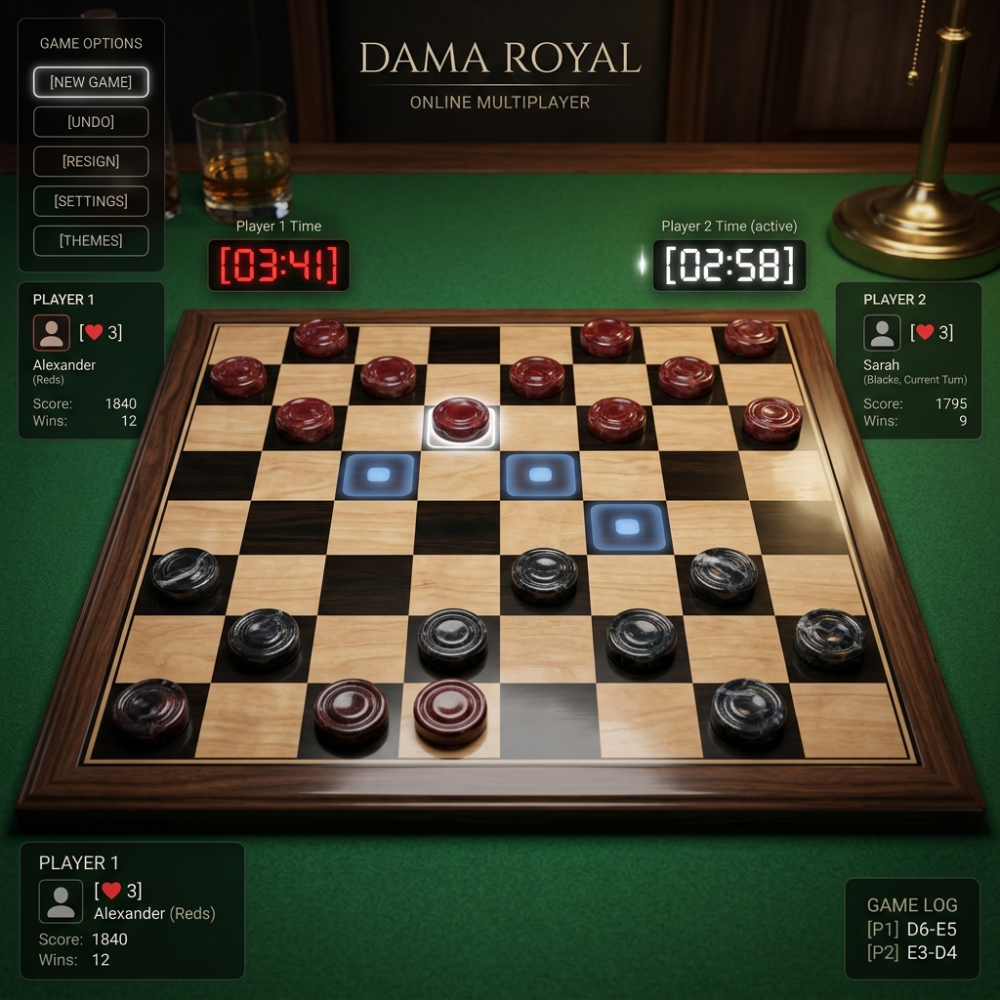
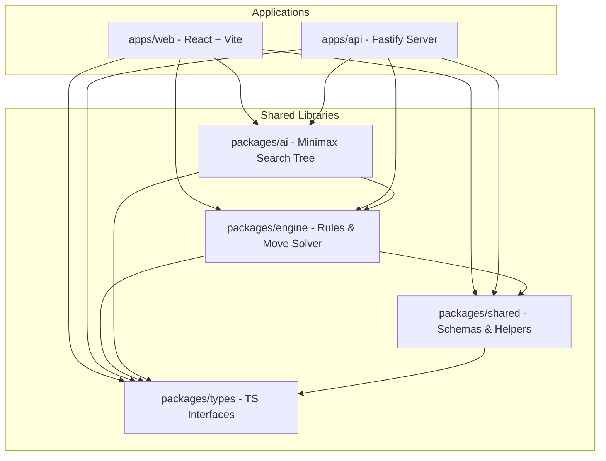
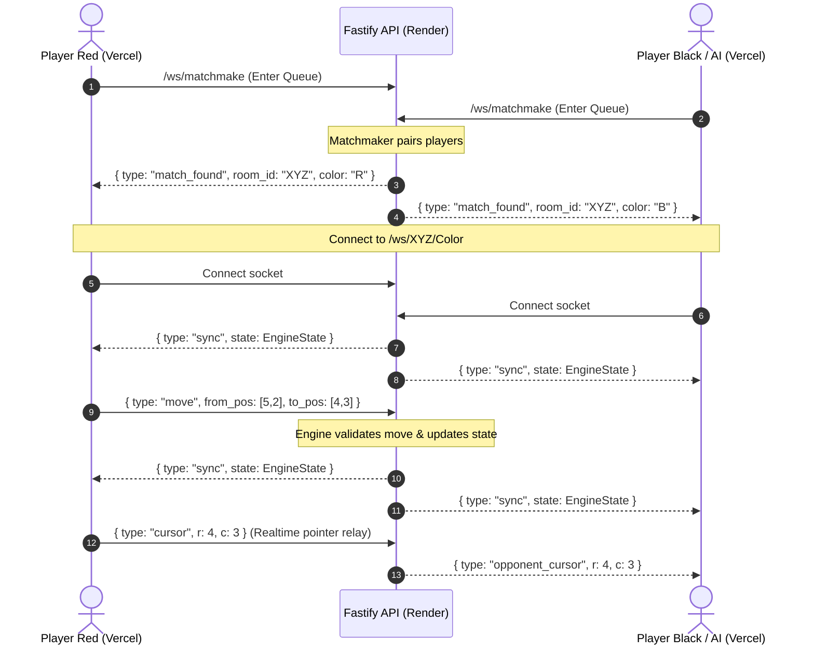

# ♟️ DAMA ARENA — Full-Stack Checkers Monorepo

[](https://opensource.org/licenses/MIT)
[](https://nodejs.org/)
[](https://www.typescriptlang.org/)
[](https://vitest.dev/)
[](https://www.fastify.io/)
[](https://react.dev/)

A modern, highly responsive, real-time multiplayer Checkers (Dama) game built as a robust **TypeScript Monorepo**. Features real-time matchmaking, lobby room websocket relays, a minimax search tree AI, and strict implementation of classic draft checkers rules (including Flying Kings and the legendary Huff penalty blow).



---

## 🏗️ Monorepo Architecture

The repository leverages **npm Workspaces** to coordinate dependencies and split concerns into clean, modular workspaces:



### Directory Map

| Path | Type | Responsibility |
|:---|:---|:---|
| **`apps/web`** | React App | Frontend user interface with canvas/CSS animations, sound manager, and game state stores. |
| **`apps/api`** | Fastify App | Backend HTTP/WebSocket game server handling matchmaking, room ticking, and socket forwarding. |
| **`packages/types`** | Package | Core shared TypeScript interfaces and models. |
| **`packages/shared`** | Package | Zod validation schemas and utility functions (e.g. notation converters, board counts). |
| **`packages/engine`** | Package | Pure rules engine (`CheckersEngine` class) maintaining state copy and resolving moves/chains. |
| **`packages/ai`** | Package | High-performance minimax search tree solver with alpha-beta pruning. |

---

## ⚡ Game Mechanics & Features

- **Real-Time Multiplayer**: Instant matchmaking or private invite links to play against friends over persistent WebSockets.
- **Minimax AI**: Play offline or singleplayer against a minimax search solver with customizable search depths (Easy, Medium, Hard).
- **Flying Kings**: Kings can slide any number of empty squares in diagonals, leap over single enemy pieces from a distance, and land on any square behind them.
- **Huff Penalty Blow**: Strict draft rules! If a player misses a mandatory capture, the opponent has 15 seconds to "huff" (blow/remove) the offending piece from the board.
- **Multi-Jump Lock**: When a piece makes a jump and has further jumps available, the turn locks to that piece until the jump chain is completed or stopped.
- **Chess Clock**: Fully integrated optional move timers with real-time WebSocket ticks.
- **Mobile Responsive Layout**: Premium CSS grid gameboard and floating scorecards tailored for all screen sizes, from mobile phones to high-resolution desktops.

---

## 🔄 WebSocket Message Protocol

The real-time gameplay relies on type-safe WebSocket event frames validated via Zod schemas:



---

## 🛠️ Local Development Setup

### Prerequisites
- Node.js >= 20.0.0
- npm >= 10.0.0

### Installation

Clone the repository and install all workspace dependencies:
```bash
git clone https://github.com/yozainan/CHECKER-S.git
cd CHECKER-S
npm install
```

### Running Locally

To run both the backend server and frontend client concurrently:

```bash
# Start the Fastify API (runs on http://localhost:8000)
npm run dev:api

# Start the Vite React client (runs on http://localhost:5173, proxying API to port 8000)
npm run dev:web
```

### Running Unit Tests

Unit tests are written using **Vitest** for the rules engine and the AI minimax configurations. To execute the tests:
```bash
npm run test
```

### Production Build

Build all packages and applications in dependency order:
```bash
npm run build
```

---

## 🚀 Deployment Guide

### Backend: Render (Free Tier)
1. Set up a new **Web Service** pointing to your repository.
2. Select branch **`main`**.
3. **Build Command**: `npm install && npm run build`
4. **Start Command**: `node apps/api/dist/index.js`
5. **Health Check Path**: `/`

### Frontend: Vercel
1. Set up a new project pointing to your repository.
2. **Framework Preset**: select **Vite**.
3. **Root Directory**: **`apps/web`**.
4. **Environment Variables**:
   - `VITE_BACKEND_URL`: `https://your-api.onrender.com` *(paste your Render backend URL)*
5. Click **Deploy**.

---

## 📄 License
This project is licensed under the MIT License - see the [LICENSE](LICENSE) file for details.
