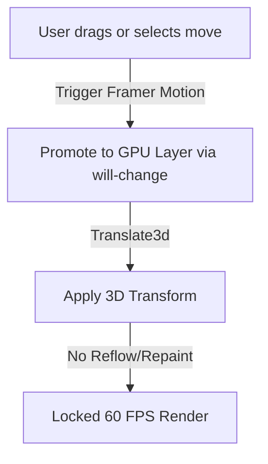
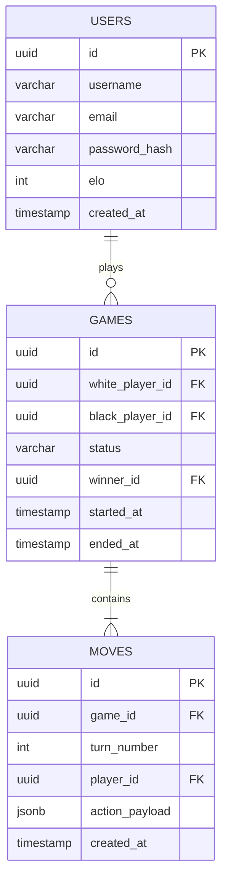
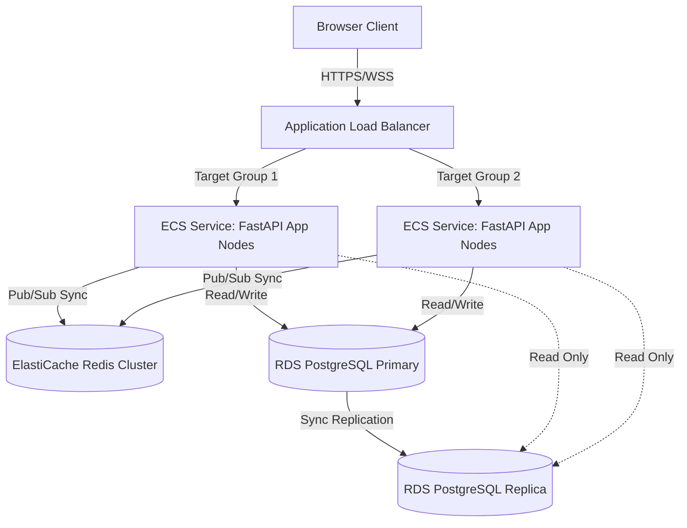

# System Design Blueprint: Modern Web Checkers (Dama) Platform
**Document Version:** 1.0.0  
**Target Architecture:** Scale to 100,000+ Concurrent Users (CCU)  
**Status:** Approved for Implementation  

---

## 1. Project Vision & Goals
Our goal is to build the definitive web-based checkers platform, matching the high-fidelity, game-like experience of modern esports titles. Traditional checkers sites suffer from sluggish layouts, basic CSS transitions, lack of interactive feedback, and high network lag during moves. 
This platform will deliver:
*   **Tactile Physics & GPU Animations:** Every move, jump, king promotion, and capture will feel tactile, backed by GPU-accelerated spring physics and rich soundscapes.
*   **Authoritative Real-Time Gameplay:** Multi-region synchronization below 50ms latency using WebSocket-based communication.
*   **FAANG-Grade Scalability:** Built on a decoupled microservices architecture with a Python-based FastAPI asynchronous engine, PostgreSQL relational storage, Redis state caching, and automated container orchestration.

---

## 2. Product Requirements & User Analysis

### 2.1 Product Requirements (PRD)
*   **Matchmaking Lobby:** Ranked (Elo-based) matchmaking, unranked quick play, and private match creation via invite codes.
*   **Interactive Game Board:** Standard 8x8 checkers board (customizable themes) with interactive drag-and-drop mechanics, valid move indicators, and instant animations.
*   **Authoritative Validation:** The client renders moves optimistically, but the server is the absolute source of truth. Invalid moves trigger rollback states.
*   **AI Battleground:** Play against an offline Web-Worker-based or server-side AI with adjustable difficulty levels.
*   **Spectator & Replay Modes:** Watch live active games or walk through historical game files step-by-step with statistical evaluation.
*   **Player Profiles:** Win/Loss ratios, rank history graphs, achievement badges, and match histories.

### 2.2 User Persona & Use Cases
*   **Competitive Players:** Demand accurate matchmaking, zero lag, precise ELO calculations, and high-performance gameplay.
*   **Casual Gamers:** Expect eye-candy visual feedback, rewarding animations (particle bursts on capture), background music, sound effects, and simple UI transitions.
*   **Spectators:** Require real-time game status updates, chat channels, and interactive boards to follow matches.

---

## 3. UI/UX Architecture & Design System

### 3.1 Design System Tokens
Our design system is dark-mode first, themed around deep slates, glowing emeralds, and warm ambers to emphasize playability.

```css
:root {
  --background: 224 71.4% 4.1%;
  --foreground: 210 20% 98%;
  --card: 224 71.4% 6.4%;
  --card-foreground: 210 20% 90%;
  --primary: 142.1 76.2% 36.3%;     /* Vibrant Emerald for UI Highlights & Jumps */
  --primary-foreground: 355.7 100% 97.3%;
  --secondary: 240 5.9% 10%;
  --accent: 38 92% 50%;             /* Amber Glow for King Pieces and Promoted States */
  --border: 240 3.7% 15.9%;
  --board-dark: 224 30% 12%;        /* Dark Square Checkers */
  --board-light: 224 15% 25%;       /* Light Square Checkers */
}
```

### 3.2 Micro-Interactions & Piece Feedback
*   **Hover States:** Hovering over a valid piece highlights its selectable state with an SVG outline glow (`filter: drop-shadow`).
*   **Active Selection:** Dragging a piece changes its cursor to `grabbing` and raises the piece vertically using a 3D shadow transform.
*   **Drag Targets:** When a piece is picked up, all valid destination tiles glow with a subtle radial gradient of `--primary` at 30% opacity.

---

## 4. Animation & Sound Architecture

### 4.1 Animation Pipeline (60 FPS / GPU Target)
To prevent frame drops on mobile devices during complex board states, all movement uses composite layers.



#### GSAP and Motion Configs
*   **Piece Slides:** Use GSAP for multi-jump sequences. If a piece performs a double capture, GSAP queues the coordinate translations as a sequential timeline:
    ```typescript
    const timeline = gsap.timeline();
    timeline.to(pieceRef.current, { x: 75, y: -75, duration: 0.2, ease: "power2.out" })
            .to(pieceRef.current, { x: 150, y: -150, duration: 0.2, ease: "power2.out" });
    ```
*   **King Promotion (3D Flip):** When a piece reaches the opposite back rank, it flips 180 degrees using CSS 3D perspectives to reveal the King's emblem.
    ```css
    .king-piece {
      transform-style: preserve-3d;
      will-change: transform;
      transition: transform 0.4s cubic-bezier(0.175, 0.885, 0.32, 1.275);
    }
    ```

### 4.2 Sound System Architecture
Sounds are managed via the Web Audio API to prevent audio latency. Background music and sound effects (SFX) are pre-fetched, loaded into memory buffers, and mixed via custom audio node routes.

```
[ Audio Source Buffer ] ──► [ Low-Pass Filter ] ──► [ GainNode (Volume) ] ──► [ AudioDestination ]
```

*   **SFX Assets:**
    *   `slide.mp3`: Subtle friction sound when dragging/sliding a piece.
    *   `capture.wav`: High-frequency impact sound for jumped pieces.
    *   `king.wav`: Regal chime for king promotions.
    *   `defeat/victory.mp3`: Cinematic audio transitions on match end.

---

## 5. Frontend Architecture (React + TypeScript)

The client is a Single Page Application optimized for static loading and real-time execution.

### 5.1 Technology Stack Selection
*   **React + TypeScript + Vite:** Fast hot-reloading and modular builds.
*   **Tailwind CSS & shadcn/ui:** Styling utility and clean UI foundations.
*   **Framer Motion & GSAP:** High-performance animation engines.
*   **Zustand:** Un-opinionated, ultra-fast global client-side state.
*   **TanStack Query:** Caching server state requests and data updates.
*   **Socket.IO Client:** Persistent WebSocket client layer.
*   **React Hook Form & Zod:** Input validation rules and schema verification.

### 5.2 Board State Management (Zustand)
Board interactions and optimistic moves are updated globally in a Zustand store.

```typescript
import { create } from 'zustand';

interface BoardState {
  board: string[][]; // 8x8 grid: null, 'W', 'B', 'WK', 'BK'
  selectedPiece: { r: number; c: number } | null;
  validMoves: { r: number; c: number }[];
  selectPiece: (r: number, c: number) => void;
  executeMoveOptimistic: (fromR: number, fromC: number, toR: number, toC: number) => void;
  rollbackBoard: (previousBoard: string[][]) => void;
}

export const useBoardStore = create<BoardState>((set) => ({
  board: initializeBoard(),
  selectedPiece: null,
  validMoves: [],
  selectPiece: (r, c) => {
    const moves = calculateValidMoves(r, c);
    set({ selectedPiece: { r, c }, validMoves: moves });
  },
  executeMoveOptimistic: (fromR, fromC, toR, toC) => {
    set((state) => {
      const nextBoard = cloneBoard(state.board);
      nextBoard[toR][toC] = nextBoard[fromR][fromC];
      nextBoard[fromR][fromC] = "";
      return { board: nextBoard, selectedPiece: null, validMoves: [] };
    });
  },
  rollbackBoard: (previousBoard) => set({ board: previousBoard })
}));
```

---

## 6. Backend Architecture (Python + FastAPI)

The backend is built as an asynchronous service in Python 3.11+, using FastAPI for HTTP and WebSocket routing.

```
                        +--------------------------+
                        |  FastAPI (Uvicorn / Asgi) |
                        +------------+-------------+
                                     |
             +-----------------------+-----------------------+
             |                                               |
  +----------v----------+                         +----------v----------+
  |    HTTP Endpoints   |                         |  WebSocket Handler  |
  +----------+----------+                         +----------+----------+
             |                                               |
    JWT / DB / Redis Cache                          Real-time Sync Loop
```

### 6.1 Core Stack
*   **FastAPI:** Asynchronous framework built on Starlette and Pydantic.
*   **SQLAlchemy (Async Engine):** Database connection pooling and async mapping.
*   **Redis Cluster:** High-performance match broker, Pub/Sub channel, and rate-limiting store.
*   **python-socketio:** ASGI-compatible engine for real-time duplex connections.
*   **Arq:** Redis-based asynchronous task queue (similar to Celery/BullMQ, but async-native).
*   **Structlog:** Asynchronous JSON logging.

### 6.2 Async Socket.IO Route Configuration
```python
import socketio
from fastapi import FastAPI
from typing import Dict

sio = socketio.AsyncServer(async_mode='asgi', cors_allowed_origins="*")
app = FastAPI()
app.mount('/ws', socketio.ASGIApp(sio))

@sio.event
async def join_match(sid, data: Dict):
    match_id = data.get("match_id")
    user_id = await get_user_from_sid(sid)
    
    await redis_client.hset(f"match:{match_id}:sessions", user_id, sid)
    sio.enter_room(sid, room=match_id)
    await sio.emit("player_joined", {"user_id": user_id}, room=match_id)

@sio.event
async def submit_move(sid, data: Dict):
    match_id = data.get("match_id")
    move = data.get("move") # {from: [r,c], to: [r,c]}
    
    is_valid, board_state = await validate_and_apply_move(match_id, move)
    if not is_valid:
        await sio.emit("move_rejected", {"error": "Invalid move state"}, to=sid)
        return
        
    await sio.emit("move_broadcast", {"move": move, "board": board_state}, room=match_id)
```

---

## 7. Matchmaking & Ranking (ELO) Engine

### 7.1 Redis-Based Matchmaking
To support thousands of matchmaking requests simultaneously, matchmaking relies on a **Redis Sorted Set (ZSET)** sorted by user Elo ratings.

```
Redis Sorted Set (matchmaking_queue)
Score (ELO)     Member (UserId)
1200            "user_45"
1215            "user_88"    <-- Range Search matches 1215 with 1200
1450            "user_99"
```

1.  **Queue Entry:** When a player clicks "Find Match", they are added to `matchmaking_queue` with their current ELO as the score.
2.  **Matchmaker Loop:** An Arq background worker polls the queue:
    *   For each user, search for another user within an ELO tolerance $\Delta$ (e.g., $\pm 50$ points).
    *   If no match is found, expand $\Delta$ by 15 points every 5 seconds.
    *   On a match, pull both users from the set atomically using a Lua Script to avoid race conditions:
        ```lua
        local u1 = redis.call('ZSCORE', KEYS[1], ARGV[1])
        local u2 = redis.call('ZSCORE', KEYS[1], ARGV[2])
        if u1 and u2 then
            redis.call('ZREM', KEYS[1], ARGV[1], ARGV[2])
            return 1
        end
        return 0
        ```
    *   Spawn a `match` document, generate a unique ID, and notify both players via WebSockets.

### 7.2 Elo Rating Calculation
When a match ends, the ELO ratings of both players are updated using the standard Elo rating formula:

$$E_A = \frac{1}{1 + 10^{(R_B - R_A)/400}}$$

$$R'_A = R_A + K \cdot (S_A - E_A)$$

Where:
*   $K$ factor = 32.
*   $S_A$ = 1 for a win, 0 for a loss, 0.5 for a draw.

---

## 8. AI Opponent Engine (Bitboard & Minimax)

To support instant, responsive gameplay when playing against the computer, the AI engine operates on a simplified bitboard representation of the checkers grid.

### 8.1 Bitboard State Representation
An 8x8 checkers board has only 32 active squares. We represent states using 32-bit unsigned integers:
*   `black_pieces`: 32-bit int.
*   `white_pieces`: 32-bit int.
*   `kings`: 32-bit int (set bit indicates a king piece).

Bit operations allow calculations of valid moves and jumps in microseconds.

```python
LEFT_SHIFT = 4
RIGHT_SHIFT = 4

def get_white_moves(white_pieces, empty_squares):
    return (white_pieces << LEFT_SHIFT) & empty_squares
```

### 8.2 Minimax with Alpha-Beta Pruning
The AI evaluates moves asynchronously to prevent locking the FastAPI event loop.
*   **Web Workers (Client-Side AI):** The browser spins up a Web Worker executing the compiled JS/WASM engine. The UI remains fully responsive.
*   **Server-Side AI:** The engine executes in a separate CPU-bound process pool using `concurrent.futures.ProcessPoolExecutor`.

```python
def minimax(position, depth, alpha, beta, maximizing_player):
    if depth == 0 or position.is_game_over():
        return position.evaluate(), None
        
    best_move = None
    if maximizing_player:
        max_eval = -float('inf')
        for move in position.get_moves():
            evaluation, _ = minimax(position.apply(move), depth - 1, alpha, beta, False)
            if evaluation > max_eval:
                max_eval = evaluation
                best_move = move
            alpha = max(alpha, evaluation)
            if beta <= alpha:
                break
        return max_eval, best_move
    else:
        min_eval = float('inf')
        for move in position.get_moves():
            evaluation, _ = minimax(position.apply(move), depth - 1, alpha, beta, True)
            if evaluation < min_eval:
                min_eval = evaluation
                best_move = move
            beta = min(beta, evaluation)
            if beta <= alpha:
                break
        return min_eval, best_move
```

---

## 9. Replay & Game Logs System

Every move made during a match is recorded sequentially and saved as an array of structured JSON objects.

### 9.1 Move Schema Format
```json
{
  "match_id": "8cbe6382-3cc1-4b1a-8bb7-005db3a31c51",
  "turn": 14,
  "player": "white_user_uuid",
  "action": {
    "type": "JUMP",
    "from": {"r": 2, "c": 3},
    "to": {"r": 4, "c": 5},
    "captured": [{"r": 3, "c": 4}]
  },
  "timestamp": "2026-06-30T17:15:00Z"
}
```

### 9.2 Replay Playback Mechanics
*   **Database Storage:** Moves are appended to the `moves` table linked via foreign key to `matches`.
*   **Playback Controller:** The frontend client fetches the entire history array on loading a replay link.
*   **Zustand Replay Hook:** The client sets the board to the initial checkers setup and maps step actions using an index pointer (`currentStep`). Incrementing or decrementing `currentStep` applies or reverses the move delta, feeding visual update instructions directly to the GPU animation transitions.

---

## 10. Database Schema (PostgreSQL DDL)



```sql
CREATE EXTENSION IF NOT EXISTS "uuid-ossp";

CREATE TABLE users (
    id UUID PRIMARY KEY DEFAULT uuid_generate_v4(),
    username VARCHAR(50) UNIQUE NOT NULL,
    email VARCHAR(100) UNIQUE NOT NULL,
    password_hash VARCHAR(255) NOT NULL,
    elo INT DEFAULT 1200 NOT NULL,
    created_at TIMESTAMP WITH TIME ZONE DEFAULT CURRENT_TIMESTAMP NOT NULL
);

CREATE TABLE games (
    id UUID PRIMARY KEY DEFAULT uuid_generate_v4(),
    white_player_id UUID REFERENCES users(id) ON DELETE SET NULL,
    black_player_id UUID REFERENCES users(id) ON DELETE SET NULL,
    status VARCHAR(20) DEFAULT 'ACTIVE' CHECK (status IN ('PENDING', 'ACTIVE', 'COMPLETED', 'ABANDONED')) NOT NULL,
    winner_id UUID REFERENCES users(id) ON DELETE SET NULL,
    started_at TIMESTAMP WITH TIME ZONE DEFAULT CURRENT_TIMESTAMP NOT NULL,
    ended_at TIMESTAMP WITH TIME ZONE
);

CREATE TABLE moves (
    id UUID PRIMARY KEY DEFAULT uuid_generate_v4(),
    game_id UUID REFERENCES games(id) ON DELETE CASCADE NOT NULL,
    turn_number INT NOT NULL,
    player_id UUID REFERENCES users(id) ON DELETE SET NULL,
    action_payload JSONB NOT NULL,
    created_at TIMESTAMP WITH TIME ZONE DEFAULT CURRENT_TIMESTAMP NOT NULL,
    CONSTRAINT unique_game_turn UNIQUE(game_id, turn_number)
);

CREATE INDEX idx_users_elo ON users (elo DESC);
CREATE INDEX idx_games_players ON games (white_player_id, black_player_id);
CREATE INDEX idx_moves_game_id ON moves (game_id);
```

---

## 11. API & WebSocket Specifications

### 11.1 REST Endpoints
*   `POST /api/v1/auth/register`: Create user profiles.
*   `POST /api/v1/auth/login`: Return JWT token in HTTPOnly cookies.
*   `GET /api/v1/leaderboard`: Return sorted users by ELO (paginated).
*   `GET /api/v1/replays/{match_id}`: Retrieve game move logs list.

### 11.2 Real-Time WebSocket Events (Socket.IO)

#### Client -> Server
*   `join_matchmaking`: Add client connection metadata to Redis ELO queue.
*   `submit_move`: Send move payload:
    ```json
    { "match_id": "uuid", "move": { "from": [2,1], "to": [3,2] } }
    ```
*   `abandon_match`: Forfeit the active match.

#### Server -> Client
*   `match_found`: Payload contains match configurations and color assignments.
*   `move_broadcast`: Broadcasts board update and player turns.
*   `match_ended`: Match winner declaration and updated ELO points.

---

## 12. Directory Structure

```
/
├── apps/
│   ├── client/                          # Frontend Application
│   │   ├── src/
│   │   │   ├── assets/                  # Audio SFX, theme templates
│   │   │   ├── components/
│   │   │   │   ├── ui/                  # shadcn/ui components (button, dialog, card)
│   │   │   │   └── board/               # CheckerBoard, CheckerPiece, MoveIndicator
│   │   │   ├── hooks/
│   │   │   │   ├── useAudio.ts          # Web Audio Context controller
│   │   │   │   └── useGameSocket.ts     # Real-time event listener binding
│   │   │   ├── store/
│   │   │   │   └── useBoardStore.ts     # Zustand game engine sync state
│   │   │   └── views/                   # GameRoom, Matchmaker, Leaderboard
│   │   ├── package.json
│   │   └── tailwind.config.js
│   │
│   └── server/                          # Backend Application
│       ├── app/
│       │   ├── core/
│       │   │   ├── config.py            # Environment variables parsing (Pydantic Settings)
│       │   │   ├── database.py          # SQLAlchemy async driver config
│       │   │   └── security.py          # Hash algorithms and JWT tokens
│       │   ├── models/
│       │   │   └── models.py            # SQLAlchemy Schema definition mappings
│       │   ├── services/
│       │   │   ├── game_engine.py       # Bitboard validation rule execution
│       │   │   ├── matchmaker.py        # Redis ELO queue manipulation rules
│       │   │   └── ai_worker.py         # Multi-process minimax computation hooks
│       │   ├── sockets/
│       │   │   └── routes.py            # Socket.IO handlers
│       │   └── main.py                  # App mount entry point
│       ├── Dockerfile
│       └── requirements.txt
```

---

## 13. Security, Caching, & Scalability

### 13.1 Security Framework
*   **Move Sanitization & Validation:** Double checks rules on both client (UX comfort) and backend (security integrity). The backend engine maintains the master board state.
*   **Websocket Authentication:** Socket handshakes require valid authorization tokens. Connection drops invalidate session persistence models.
*   **SQL Injection & CSRF:** Strict ORM abstractions block SQL attacks. SameSite attributes defend cookies from cross-site scripts.

### 13.2 Distributed Caching Layout
*   **Active Matches Cache:** Redis hashes track the board configuration, player IDs, and turn histories.
*   **Session Locks:** Ensure a user cannot participate in multiple matches simultaneously using Redis session keys (`session:active:{user_id}`).

### 13.3 Scaling to 100,000+ Concurrent Users (CCU)
*   **WebSocket Scaling (Redis Adapter):** Socket.IO instances share state via the Redis Pub/Sub adapter. If Player A is connected to Node 1 and Player B is connected to Node 2, Redis routes events between them.
*   **PgBouncer:** Solves PostgreSQL connection limits by pooling FastAPI async DB sessions.
*   **Read Replicas:** Read queries (history tables and leaderboards) target read-replicas, keeping the master database dedicated to active game transactions.

---

## 14. Infrastructure & CI/CD

### 14.1 Docker Infrastructure

#### Frontend Dockerfile
```dockerfile
FROM node:20-alpine AS builder
WORKDIR /app
COPY package*.json ./
RUN npm ci
COPY . .
RUN npm run build

FROM nginx:stable-alpine
COPY --from=builder /app/dist /usr/share/nginx/html
EXPOSE 80
CMD ["nginx", "-g", "daemon off;"]
```

#### Backend Dockerfile
```dockerfile
FROM python:3.11-slim
WORKDIR /app
ENV PYTHONUNBUFFERED=1 \
    PYTHONDONTWRITEBYTECODE=1
RUN apt-get update && apt-get install -y --no-install-recommends gcc build-essential && rm -rf /var/lib/apt/lists/*
COPY requirements.txt .
RUN pip install --no-cache-dir -r requirements.txt
COPY . .
EXPOSE 8000
CMD ["uvicorn", "app.main:app", "--host", "0.0.0.0", "--port", "8000", "--workers", "4"]
```

### 14.2 Deployment Topology (AWS ECS Fargate)


### 14.3 CI/CD GitHub Actions Pipeline
```
[ Commit to main ] ──► [ Lint & Type Checks ] ──► [ Pytest & Vitest Runs ]
                              │
                              ▼
                      [ Build Docker ]
                              │
                              ▼
                      [ Push to AWS ECR ]
                              │
                              ▼
                 [ AWS ECS Service Update ] (Rolling Update / Canary)
```

---

## 15. Testing & Observability

### 15.1 Testing Strategy
*   **Unit Tests (Pytest):** Test logic limits, ELO modifications, and validation scenarios.
*   **Component Tests (Vitest):** Validate React board clicks and drag events.
*   **Load Testing (Locust):** Run simulated scripts testing matchmaking loads and WebSocket concurrency thresholds.

### 15.2 Observability Stack
*   **Structured Logs:** Structlog writes trace logs to STDOUT in structured JSON layouts parsed by log aggregators.
*   **Metrics Reporting:** OpenTelemetry tracks duration metrics and connection stats. Prometheus aggregates metric loops for Grafana visualization dashboards.

---

## 16. Phased Implementation Roadmap

```
Phase 1: Foundations (Week 1-2)
├─ Set up FastAPI framework & database models
├─ Scaffold React with Tailwind & Shadcn components
└─ Standard local move engine calculation validation

Phase 2: Real-time Play (Week 3-4)
├─ Socket.IO match connection loops
├─ Redis state cache sync
└─ Optimistic client animation transitions and rollbacks

Phase 3: Matchmaking & AI (Week 5-6)
├─ Redis-backed matchmaking queue ELO routing
├─ Client/Server minimax engines integration
└─ Step-by-step game move logs replay system

Phase 4: Scaling & Deploy (Week 7-8)
├─ Docker container builds
├─ OpenTelemetry tracking integrations
└─ ECS Fargate staging deployment and Locust load validations
```
